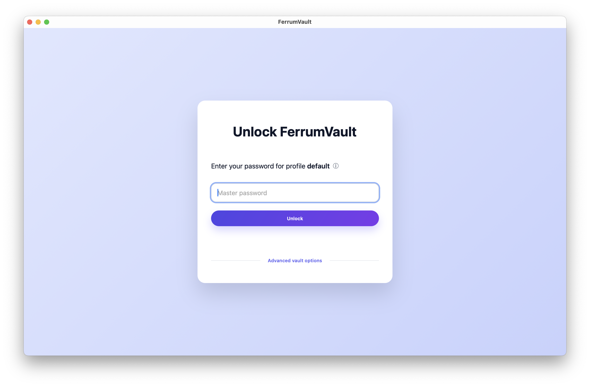
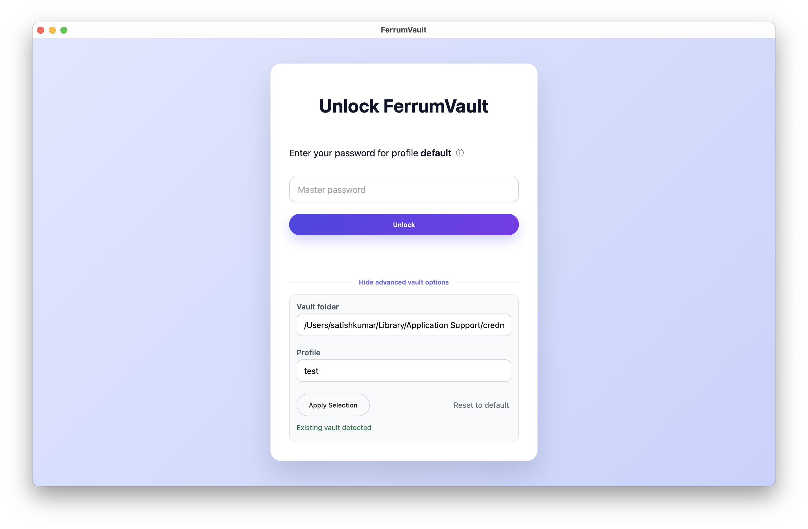
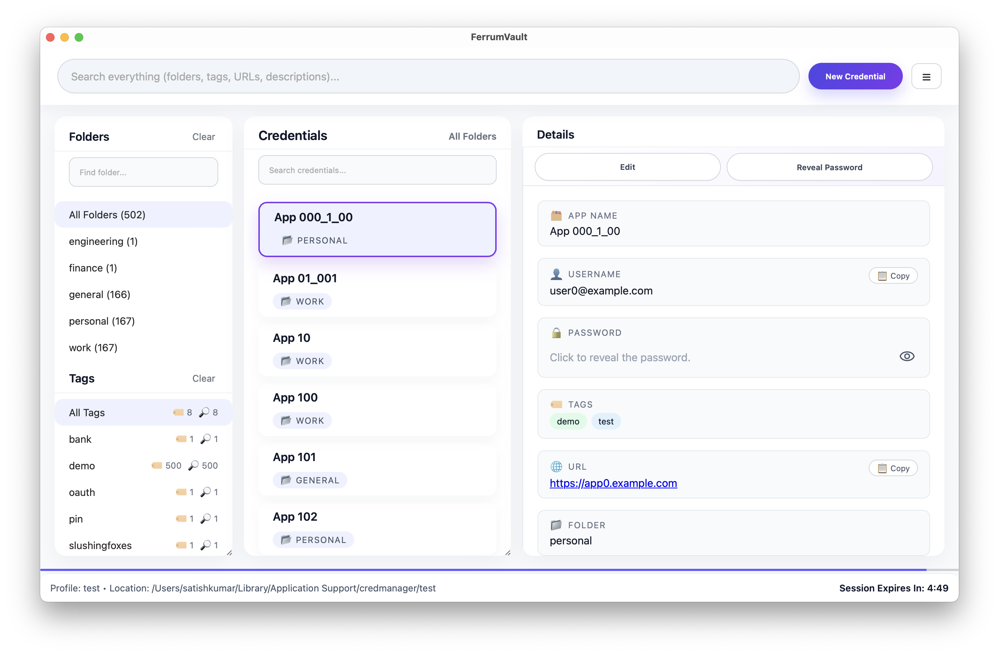
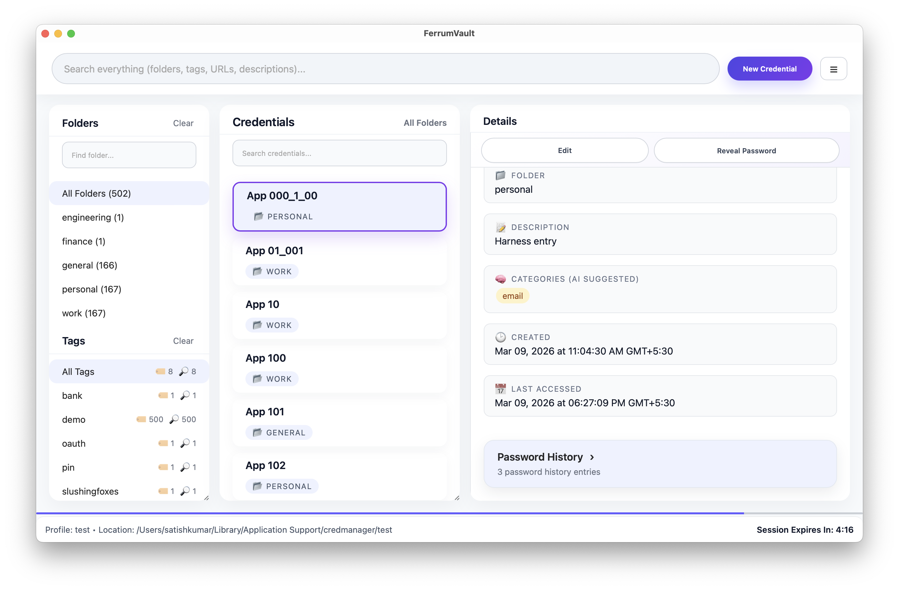
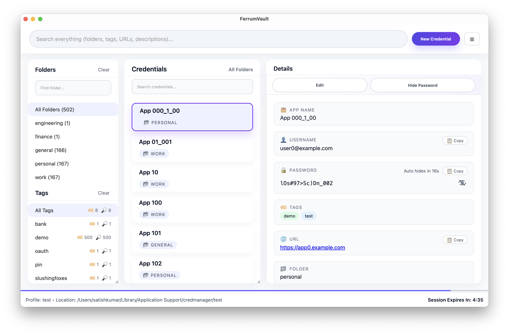
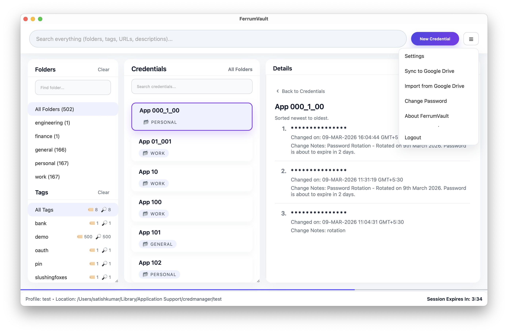
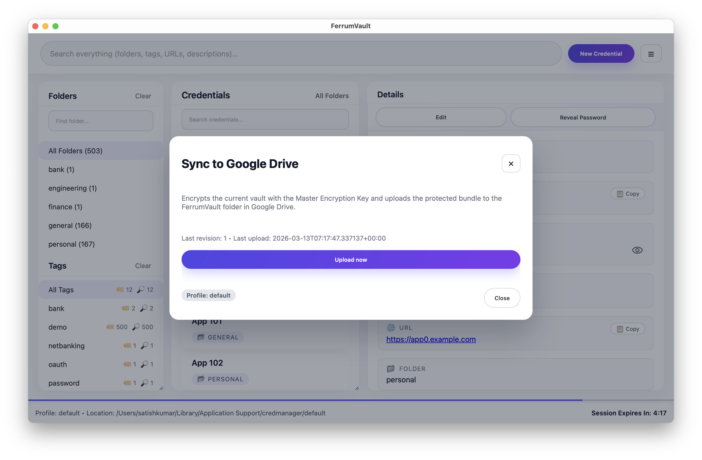
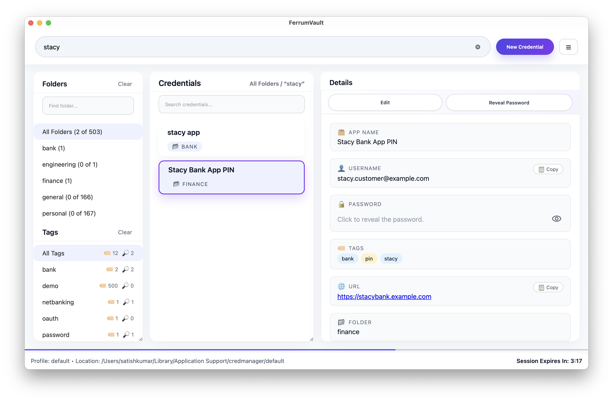
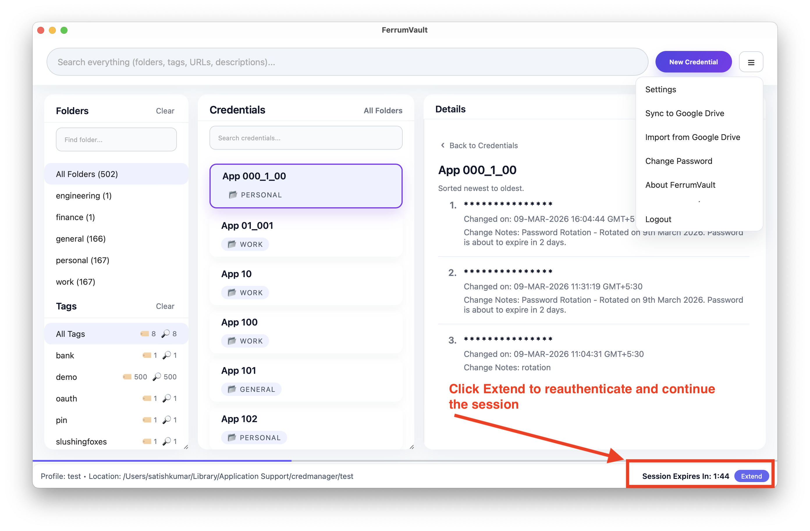

# FerrumVault Desktop

FerrumVault is a Tauri-based desktop credential manager with a Rust core. It combines a secure vault engine, SQLite-backed storage, and a responsive web UI.

## Features
- **Three-pane UI** with folders, credentials, and detail view.
- **Secure storage** powered by Rust (`credmanager_app`) with AES-GCM, PBKDF2, and sharded storage.
- **Modern Tauri shell** (`src-tauri`) serving the frontend bundle in `ui-frontend/dist`.
- **CLI tooling** for initializing vaults, running harness tests, and debugging the vault engine.
- **Advanced UI interactions**: drag-and-drop between folders, live search filters, skeleton loading states, copy-to-clipboard shortcuts, and password reveal timers.

## Repository layout
```
├─ src/                 # Rust CLI and shared core library (credmanager_app)
├─ src-tauri/           # Tauri desktop shell and commands
├─ ui-frontend/         # Frontend source assets (dist output served by Tauri)
├─ docs/                # Design documents and proposals
└─ target/              # Cargo build artifacts (ignored)
```

## Development
1. **Install prerequisites**
   - Rust toolchain (`cargo`), Node.js (for frontend tooling), and Tauri prerequisites for your platform.
2. **Bootstrap**
   ```bash
   cargo test
   cd src-tauri && cargo run
   ```
   The Tauri shell serves the UI from `ui-frontend/dist`. Rebuild that bundle when modifying `main.js` or `style.css`.
3. **CLI usage**
   ```bash
   cargo run -- init                                    # Initialize vault schema
   cargo run -- harness --total 500                     # Run storage harness (resets profile)
   cargo run -- harness --profile qa --base-dir /tmp    # Harness against alternate vault roots
   cargo run -- harness --total 100 --password "Demo!234"  # Non-interactive harness run
   cargo run -- ui                                      # Render CLI UI preview
   ```
   The harness seeds randomly generated credentials plus two fixtures: the 4-digit
   **“Stacy Bank App PIN”** record and a **SlushingFoxes OAuth access token** built by
   repeating a fixed JWT blob ten times. Their deterministic values make it easy to probe
   sharding/assembly behavior during manual testing.
4. **Frontend edits**
   - Modify `ui-frontend/dist/main.js` and `style.css`, then rerun `cargo run` from `src-tauri`.

## Screenshots
Visual walkthroughs live under `./screenshots`. Highlights from the latest build are shown below.

**Unlock & Profiles** – The login flow lets you pick base folders and switch profiles before unlocking.



**Profile picker while unlocking** – Quickly swap between work, personal, or finance vaults.



**Vault home** – The refreshed three-pane layout keeps folders, credentials, and detail views within reach.



**Credential detail** – View usernames, URLs, notes, and one-click copy buttons.



**Password reveal & copy** – Two-step reveals with timers keep secrets safe while you copy.



**Password history** – See previous versions with timestamps before restoring any value.


**Command hub & settings** – The hamburger menu surfaces features like Google Drive sync, settings, and session info.



**Google Drive backup** – Upload encrypted bundles, authenticate with OAuth, or import vaults on a clean machine.



**Global search & quick add** – Search across every field or create a credential from the dashboard.



**Session controls** – Extend session timers or change the master password directly from the UI.



## Testing
Run all Rust unit tests:
```bash
cargo test
```

For UI verification, rebuild the Tauri shell and exercise the unlock flow, drag-and-drop, and password reveal interactions.

## Contributing
- Keep lint/tests green (`cargo fmt && cargo clippy --all-targets -- -D warnings`, `cargo test`).
- Avoid committing build artifacts (see `.gitignore`).
- Coordinate UI changes so the Tauri bundle is rebuilt before testing.

Happy credential managing!
